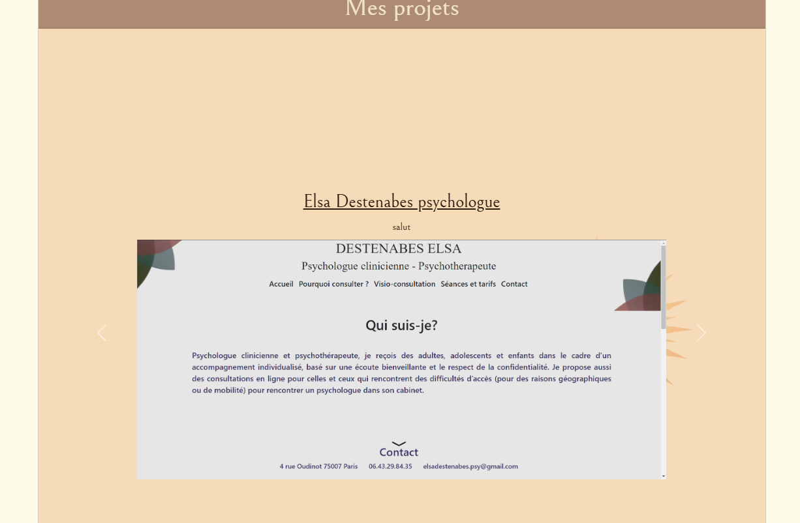

# melchior-jorda.online

## Links
- [Version française](README/README_FR.md)
- [Versión en Español](README/README_ES.md)
- [Visit the website](https://melchior-jorda.online/index.html)

## Description
Welcome to **melchior-jorda.online**! This project serves as the source code for my personal website, designed to be **responsive** and **dynamic**. The primary goal of this site is to showcase my work and skills in web development. With a user-friendly interface and attractive design, visitors can explore my projects, learn more about my skills, and easily contact me.

## Technologies Used
This project utilizes several technologies to ensure an optimal user experience:
- **HTML/CSS**: Provide the structure and style of the website, ensuring a clear and pleasant layout.
- **JavaScript**: Adds interactivity and dynamism to the site, enabling advanced features such as animations and real-time updates.
- **PHP**: Handles server-side operations, including form processing and data management.
- **JSON**: Used as a data exchange format, facilitating communication between the client and the server.

## Usage
This code is designed to present my work in a professional manner. To view the site, simply download the project files and open `index.html` in your browser. You will then have access to all the features and the interface I developed.

## Screenshots
Here are some screenshots that illustrate the design and functionalities of my site:

## Licenses
This project is licensed by Melchior (myself). For any questions or requests for use, feel free to contact me via the contact form on the website.
