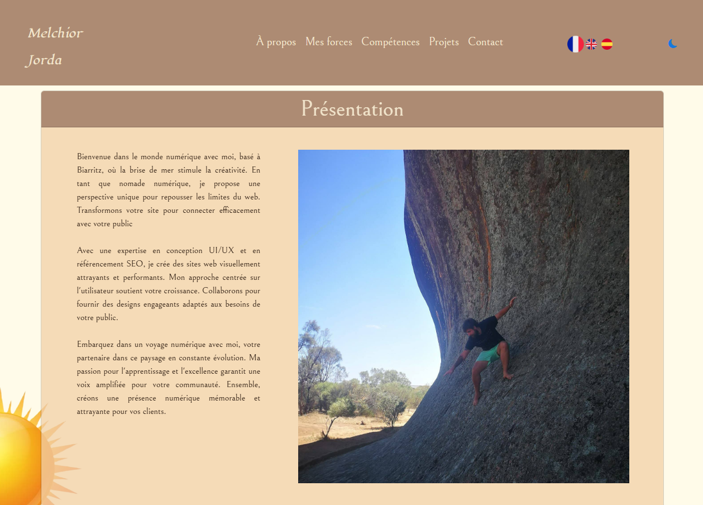
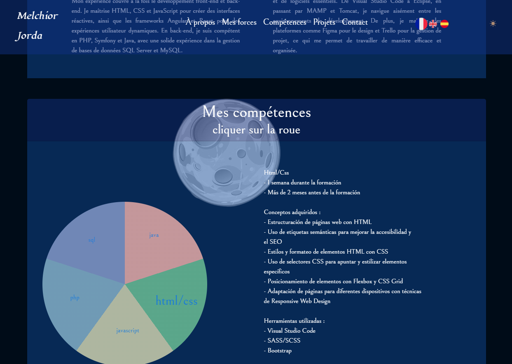

# melchior-jorda.online

## Links
- [Version française](README/README_FR.md)
- [Versión en Español](README/README_ES.md)
- [Visit the website](https://melchior-jorda.online/index.html)

## Description
Welcome to **melchior-jorda.online**! This project serves as the source code for my personal website, designed to be **responsive** and **dynamic**. The primary goal of this site is to showcase my work and skills in web development. With a user-friendly interface and attractive design, visitors can explore my projects, learn more about my skills, and easily contact me.

## Technologies Used
This project utilizes several technologies to ensure an optimal user experience:
- **HTML/CSS**: Provide the structure and style of the website, ensuring a clear and pleasant layout.
- **JavaScript**: Adds interactivity and dynamism to the site, enabling advanced features such as animations and real-time updates.
- **PHP**: Handles server-side operations, including form processing and data management.
- **JSON**: Used as a data exchange format, facilitating communication between the client and the server.

## Usage
This code is designed to present my work in a professional manner. To view the site, simply download the project files and open `index.html` in your browser. You will then have access to all the features and the interface I developed.

## Screenshots
Here are some screenshots that illustrate the design and functionalities of my site:

## I/Presentation
Welcome to **melchior-jorda.online**! I am Melchior, a web development enthusiast always looking for new opportunities to learn and create. This site is designed not only to showcase my technical skills but also to offer my web development services. My approach is user-centered, aiming to provide effective and aesthetic solutions. I am committed to working with my clients to realize their projects according to their specific needs.

## II/Pie Chart of My Skills
One of the key features of my site is the interactive pie chart, which highlights my technical skills. When a user clicks on the Java icon, the chart displays my skill levels and experiences in this area.

If you click on HTML/CSS, the chart updates, reflecting my skills in these languages. This allows visitors to quickly visualize my expertise in web design.

The same chart is also available in English, reaching a broader audience.

Finally, the chart is also available in Spanish, ensuring that my skills are accessible to a Spanish-speaking audience.

For users who prefer a dark interface, the dark mode is also available, offering an alternative visual experience.

Additionally, the chart is designed to display a clear header, facilitating navigation and understanding of the information presented.

## III/My Completed Projects
On my site, you will also find an interactive carousel showcasing my recent projects. This carousel allows visitors to easily scroll through my accomplishments and explore the different aspects of my work.

## IV/Contact Form & Reception
Finally, I have integrated a contact form on the site. This form allows visitors to send me formatted messages, thereby facilitating communication and feedback.

When the form is submitted, I receive an email formatted according to my preferences, allowing me to effectively manage contact requests.

## Licenses
This project is licensed by Melchior (myself). For any questions or requests for use, feel free to contact me via the contact form on the website.
