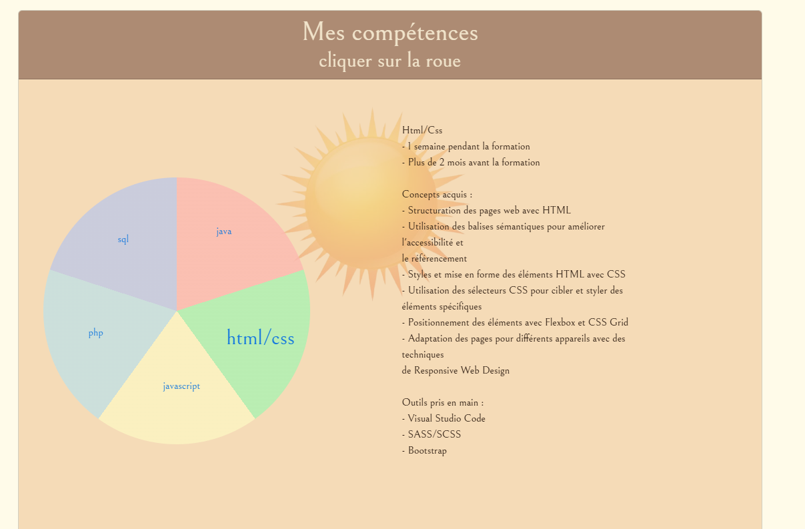

# melchior-jorda.online

## Links
- [English version](../README.md)
- [Versión en Español](README_ES.md)
- [Visitez le site](https://melchior-jorda.online/index.html)

## Description
Bienvenue sur **melchior-jorda.online** ! Ce projet constitue le code source de mon site web personnel, développé pour être **responsive** et **dynamique**. L'objectif principal de ce site est de présenter mes travaux et mes compétences en développement web. Grâce à une interface conviviale et à un design attrayant, les visiteurs peuvent explorer mes projets, en apprendre davantage sur mes compétences et me contacter facilement.

## Technologies utilisées
Ce projet utilise plusieurs technologies pour garantir une expérience utilisateur optimale :
- **HTML/CSS** : Fournissent la structure et le style du site web, assurant une mise en page claire et agréable.
- **JavaScript** : Ajoute de l'interactivité et du dynamisme au site, permettant des fonctionnalités avancées telles que des animations et des mises à jour en temps réel.
- **PHP** : Gère les opérations côté serveur, y compris le traitement des formulaires et la gestion des données.
- **JSON** : Utilisé comme format d'échange de données, facilitant la communication entre le client et le serveur.

## Utilisation
Ce code est conçu pour présenter mon travail de manière professionnelle. Pour visualiser le site, il vous suffit de télécharger les fichiers du projet et d'ouvrir `index.html` dans votre navigateur. Vous aurez ainsi accès à toutes les fonctionnalités et à l'interface que j'ai développées.

## Screenshots
Voici quelques captures d'écran qui illustrent le design et les fonctionnalités de mon site :

## Licences
Ce projet est sous la licence de Melchior (moi-même). Pour toute question ou demande d'utilisation, n'hésitez pas à me contacter via le formulaire de contact sur le site.
