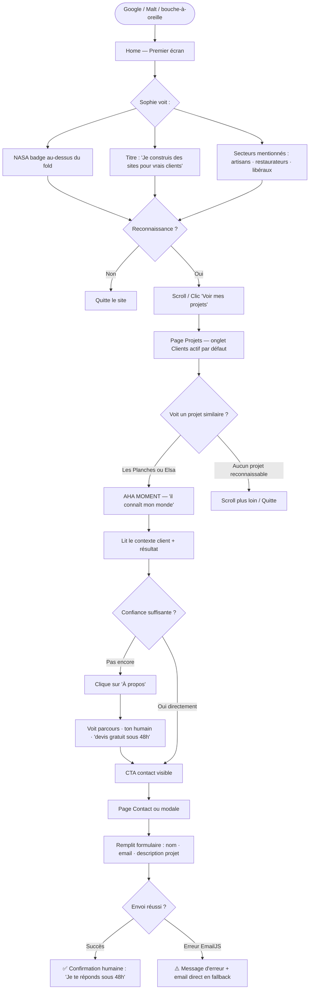
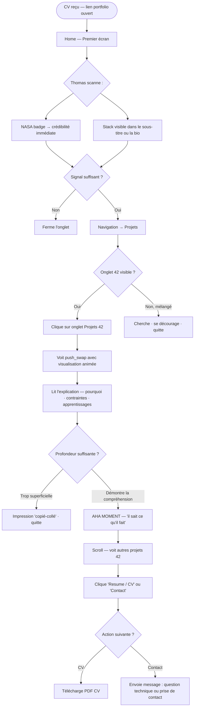
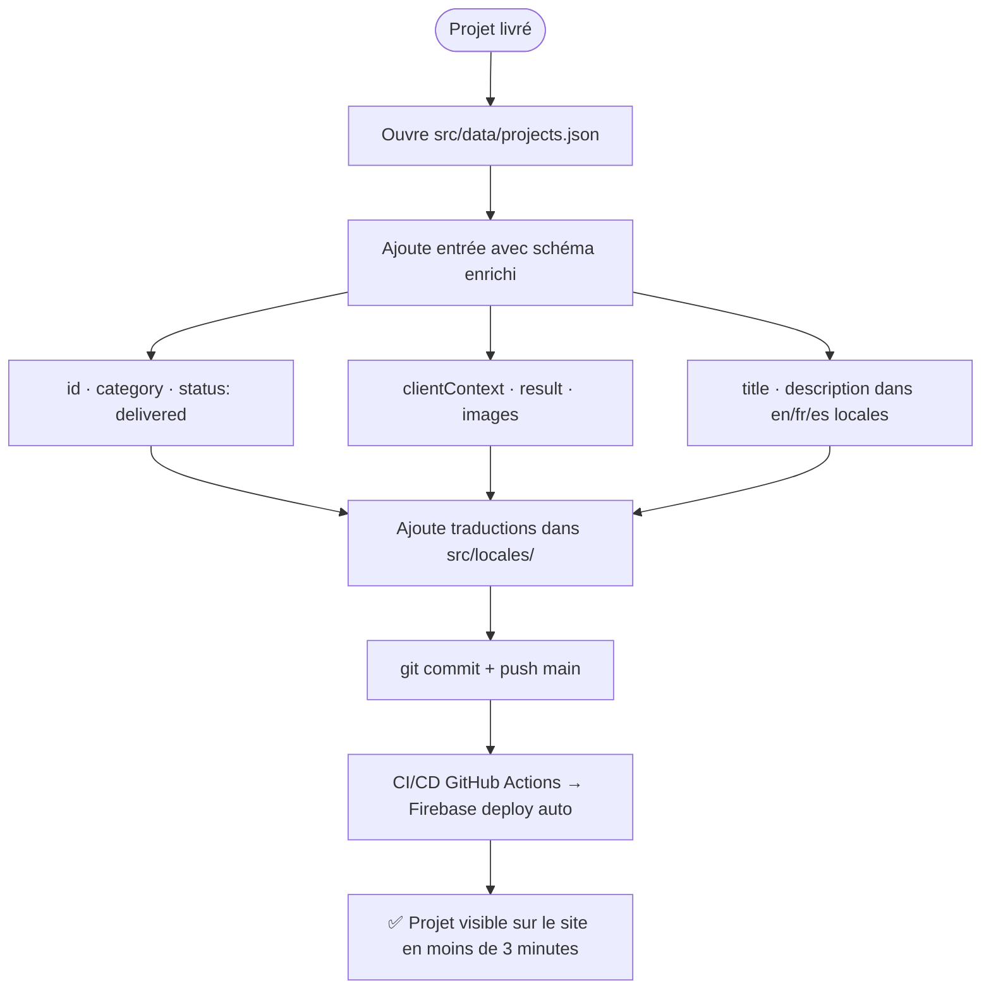

# UX Design Specification — melchior-jorda.online

**Author:** Mel
**Date:** 2026-03-13

---

<!-- UX design content will be appended sequentially through collaborative workflow steps -->

## Executive Summary

### Project Vision

melchior-jorda.online est un outil de conversion actif à double mission :
convertir des visiteurs en clients freelance (artisans, restaurateurs, professions
libérales, e-commerçants locaux) ET convaincre des recruteurs tech de la solidité
du profil. Le différenciateur central est la preuve d'exécution réelle — projets
livrés, NASA 1ère place Málaga 2025, formation 42 — présentée avec contexte humain,
pas comme une liste technique.

Le portfolio existe déjà (Vue 3 SPA, 19 projets, trilingue FR/EN/ES, dark/light mode).
Ce UX design couvre les améliorations brownfield ciblées pour le transformer
en outil de conversion.

### Target Users

**Sophie — cliente freelance (persona principal)**
Gérante de chambre d'hôtes ou profession libérale locale, 35-50 ans, mobile-first,
non-technique. Cherche confiance + preuve terrain avant tout. Frein principal :
contenu trop technique, impossibilité de se projeter dans les projets présentés.
Aha moment : voir un projet similaire au sien (Les Planches, Elsa Psychologue)
avec contexte client et résultat concret.

**Marc — entrepreneur e-commerce (persona secondaire client)**
Entrepreneur cherchant à lancer une boutique en ligne. Cherche la preuve qu'on
a déjà livré exactement ce dont il a besoin. Aha moment : voir Le Nain Vert
(e-commerce livré) avec résultat concret.

**Thomas — recruteur tech (persona recruteur)**
CTO/lead tech, filtre vite, cherche rigueur et autonomie. Connaît 42 comme signal
fort. Aha moment : visualisation animée d'un projet 42 + explication qui démontre
la compréhension, pas juste l'exécution.

**Mel — propriétaire (admin persona)**
Veut maintenir le contenu (ajouter projets, mettre à jour statuts) sans modifier
le code des composants.

### Key Design Challenges

**1. Tension dark mode / accessibilité grand public**
Le dark mode + EN par défaut envoie un signal "portfolio de dev" qui parle à
Thomas mais peut intimider Sophie. Le premier écran doit immédiatement signaler
"je comprends ton monde" via le ton, les visuels de projets clients, et la mise
en avant du contexte humain avant la stack.

**2. Navigation duale sans duplication**
La page Projets actuelle mélange projets clients et projets 42. Il faut créer
des chemins distincts (onglet 42 dédié) sans fragmenter l'expérience. Sophie suit
les projets clients, Thomas suit les projets 42 — les deux chemins coexistent
naturellement.

**3. Créer l'offre freelance de zéro — signal d'accessibilité sans prix affiché**
Section inexistante. Doit répondre à la question implicite de Sophie ("est-ce
pour moi ?") sans ancrer la conversation sur un chiffre. Le signal d'accessibilité
passe par les projets présentés (secteurs clients reconnaissables) et le
positionnement ("tarifs juniors, devis gratuit sous 48h") plutôt que par une
grille tarifaire.

**4. CTA contact omniprésent**
Sophie doit atteindre le formulaire en ≤ 2 clics depuis n'importe quelle page.
Un CTA persistant ou contextuel est nécessaire sur toutes les pages.

### Design Opportunities

**1. L'onglet 42 comme vitrine technique inégalée**
Un espace dédié aux projets 42 (visualisations animées, explications profondes)
peut devenir un différenciateur fort pour Thomas — quelque chose qu'il n'a jamais
vu dans un portfolio junior. Séparé du flux client, il ne perturbe pas Sophie.

**2. Les projets clients comme case studies légers**
Transformer chaque projet client en micro-narration (contexte → problème →
solution → résultat) plutôt qu'une fiche technique. Sophie reconnaît sa situation,
Marc voit la livraison, Thomas voit la pensée produit derrière le code.

**3. La section offre comme filtre de qualification**
Une section "Ce que je construis" avec les types de projets et les profils clients
cibles (artisans, restaurateurs, professions libérales, e-commerçants) agit comme
un miroir pour Sophie — elle se reconnaît avant même de lire les projets.

## Core User Experience

### Defining Experience

L'action centrale du portfolio est de déclencher un premier contact qualifié.
Tout le design converge vers ce moment unique : un visiteur passe de "je regarde"
à "j'envoie un message". Ce passage doit être court, naturel, et évident depuis
n'importe quelle page.

La valeur du portfolio ne se mesure pas en visites — elle se mesure en messages
reçus. L'UX design doit optimiser chaque écran pour réduire la distance entre
la découverte et le formulaire.

### Platform Strategy

**Plateforme :** Web SPA responsive (Vue 3), mobile-first validé.
L'expérience mobile actuelle est solide et peu chargée — les améliorations MVP
doivent enrichir sans alourdir. Toute nouvelle section ou composant est soumis
au test mobile-first avant intégration.

**Interaction :** Touch (mobile, prioritaire) + mouse/keyboard (desktop).
**Mode par défaut :** Dark mode + langue EN — maintenu tel quel, le ton et les
contenus compensent le signal "portfolio de dev" pour Sophie.
**Offline :** Non requis (SPA statique Firebase Hosting).

### Effortless Interactions

Ces actions doivent demander zéro effort cognitif — elles doivent juste fonctionner :

- **Trouver un projet similaire à sa situation** : via onglets ou filtres visuels
  (clients vs 42), sans avoir à lire toute la page
- **Atteindre le formulaire de contact** : CTA visible et accessible en ≤ 2 clics
  depuis n'importe quelle page, y compris depuis les cartes projets
- **Comprendre ce que Mel fait et pour qui** : section offre lisible en 10 secondes,
  sans jargon technique
- **Switcher de langue** : déjà fonctionnel, ne pas régresser

### Critical Success Moments

**Pour Sophie :**
Voir Les Planches ou Elsa Psychologue avec contexte client visible
(secteur + problème + résultat) → "c'est quelqu'un qui connaît mon monde"

**Pour Marc :**
Voir Le Nain Vert (e-commerce livré) avec résultat concret visible
→ "il a déjà fait exactement ce dont j'ai besoin"

**Pour Thomas :**
Voir push_swap avec visualisation animée + explication technique profonde
→ "ce mec sait ce qu'il fait, pas juste ce qu'il exécute"

**Moment critique absolu — formulaire contact :**
L'envoi du formulaire est la seule interaction à zéro tolérance de défaillance.
Feedback visuel clair (envoi en cours → succès → message de confirmation),
gestion d'erreur explicite si EmailJS est indisponible, protection honeypot
maintenue. C'est le seul moment où une friction = conversion perdue.

### Experience Principles

**1. Confiance avant compétence**
Pour Sophie, la confiance se construit par la reconnaissance (projets similaires,
ton humain, secteurs familiers) avant les credentials techniques. L'ordre
d'information prime : contexte humain → preuve → puis stack technique.

**2. Le formulaire est sacré**
Zéro friction entre un visiteur intéressé et le bouton Envoyer. CTA omniprésent,
formulaire simple, feedback immédiat, fallback d'erreur explicite.

**3. Deux chemins, un seul site**
Sophie suit les projets clients, Thomas suit les projets 42. Les deux chemins
coexistent naturellement depuis la même interface — personne ne se sent dans
le mauvais endroit.

**4. L'accessibilité par le contexte, pas par les prix**
Les projets (secteurs clients reconnaissables) et le ton ("devis gratuit sous 48h")
font le signal d'accessibilité. Aucune grille tarifaire ne doit ancrer la conversation
avant même le premier contact.

**5. Mobile-first acquis — ne pas régresser**
La base mobile est solide et légère. Chaque amélioration MVP passe le test :
est-ce que ça alourdit l'expérience mobile ? Si oui, repenser avant d'implémenter.

## Desired Emotional Response

### Primary Emotional Goals

**Sophie (cliente freelance) :** Reconnaissance → Confiance → Action
"C'est fait pour moi. Il connaît mon monde. Je peux lui faire confiance."
L'objectif n'est pas l'admiration — c'est la reconnaissance. Sophie doit se
voir dans les projets présentés avant de voir Mel.

**Thomas (recruteur tech) :** Respect → Intrigue → Conviction
"Ce junior est différent. Il comprend ce qu'il fait, pas juste ce qu'il exécute."
L'objectif est le respect professionnel rare — pas la fascination pour une
animation, mais la conviction qu'il y a une vraie pensée derrière le code.

**Marc (entrepreneur e-commerce) :** Espoir → Reconnaissance → Soulagement
"Il a déjà fait exactement ça. Je n'ai pas à lui expliquer ce que je veux."

### Emotional Journey Mapping

**Découverte (premier écran) :**
→ Signal immédiat : *sérieux, pas amateur*
NASA badge + projets avec noms de vrais clients = crédibilité instantanée
avant que le doute "trop junior ?" ait le temps de s'installer

**Exploration (projets, offre) :**
→ *À l'écoute* ressenti à travers les descriptions
Les projets sont écrits du point de vue du client ("le défi était...", "le
résultat..."), pas du point de vue du dev. Sophie se reconnaît. Marc voit
son futur projet. Thomas lit quelqu'un qui pense produit.

**Aha moment :**
→ *Curieux* devient différenciateur
La variété des secteurs (restauration, psychologie, e-commerce, systèmes C)
et la profondeur des explications 42 signalent une curiosité intellectuelle
qui rassure : cet homme s'adapte, il ne récite pas.

**Contact :**
→ *Sérieux* dans la promesse
"Devis gratuit sous 48h" — pas "je répondrai peut-être". Le sérieux s'exprime
aussi dans la micro-copie des engagements.

**Si quelque chose rate (erreur formulaire) :**
→ *À l'écoute* même dans l'échec
Message d'erreur humain, alternatif clair (email direct), pas de mur technique.

### Micro-Emotions

**Confiance vs Scepticisme**
Priorité absolue pour Sophie. Contre-mesure : vrais noms de clients, photos
de projets livrés, résultats concrets visibles sans chercher.

**Respect vs Condescendance**
Pour Thomas : la profondeur des explications 42 évite le piège "c'est joli mais
superficiel". Chaque projet 42 montre la pensée, pas juste la livraison.

**Reconnaissance vs Aliénation**
Pour Sophie et Marc : les descriptions de projets en langage client (pas en
jargon tech) font qu'ils se sentent compris, pas étrangers.

**Sérénité vs Anxiété**
Absence de prix = suppression d'une source d'anxiété prématurée. La promesse
de réponse rapide = sérénité post-contact.

### Design Implications

**Sérieux →**
- Qualité visuelle homogène des mockups/captures de projets (pas de screenshots
  flous ou de placeholders)
- Micro-copie sans fautes, ton professionnel mais direct
- Promesses concrètes et tenues ("sous 48h", "devis gratuit")
- NASA badge au-dessus de la ligne de flottaison home — pas enfoui

**À l'écoute →**
- Descriptions de projets écrites du point de vue du client, pas du dev
- Formulaire de contact avec ton conversationnel ("Parle-moi de ton projet")
- Page About qui montre l'empathie métier (comprendre les artisans, les TPE)
- Sections offre organisées par profil client ("Tu es restaurateur ? artisan ?")

**Curieux →**
- Variété des secteurs affichée comme une force, pas dispersée comme une faiblesse
- Section 42 avec visualisations qui donnent envie d'explorer, pas juste de valider
- Ton qui montre l'enthousiasme pour les problèmes difficiles (42 + NASA)

### Emotional Design Principles

**1. Contrer "trop junior" avant que le doute s'installe**
Les preuves de sérieux (NASA, projets livrés avec noms réels, 42) doivent
apparaître *au-dessus de la ligne de flottaison* — pas à mi-page après que
Sophie a déjà décidé de partir. La crédibilité ne se mérite pas, elle se montre
dès le premier écran.

**2. L'émotion de Sophie passe par ses yeux, pas par sa tête**
Sophie ne lira pas un CV. Elle regardera les images de projets, reconnaîtra
Les Planches ou Elsa, et *ressentira* avant de *raisonner*. Le design doit
provoquer la reconnaissance visuelle avant l'argumentation textuelle.

**3. Les trois adjectifs comme filtre de décision UX**
Pour chaque choix de design : est-ce que ça projette *sérieux* ? Est-ce que
ça montre quelqu'un *à l'écoute* ? Est-ce que ça exprime de la *curiosité* ?
Si la réponse est non aux trois, revoir le choix.

**4. La vulnérabilité de "junior" devient une force**
"Tarifs accessibles, regard neuf, pleinement disponible" — le positionnement
junior peut être une proposition de valeur pour Sophie et Marc (une grande
agence ne ferait pas ça pour 500-800 €). Thomas, lui, cherche l'autonomie,
pas l'ancienneté.

## UX Pattern Analysis & Inspiration

### Inspiring Products Analysis

Pas de référence directe identifiée par Mel. L'analyse s'appuie sur les patterns
établis dans le secteur des portfolios freelance et des sites de prestataires
de services locaux, filtrés par les objectifs émotionnels et fonctionnels définis
aux étapes précédentes.

**Portfolios freelance efficaces (patterns observés)**
Les portfolios qui convertissent des clients non-techniques partagent trois
caractéristiques : une proposition de valeur lisible en 5 secondes, des preuves
sociales visibles sans cliquer (noms de clients réels, résultats chiffrés), et
un chemin court vers le contact. Ils ressemblent moins à des CVs qu'à des
pages de service orientées client.

**Sites de prestataires de confiance (pattern Sophie)**
Les artisans et professions libérales font confiance aux sites qui : montrent
de vraies photos de vrais travaux (pas de stock), nomment leurs clients ou
secteurs, et s'expriment dans leur langage (pas le jargon de leur propre métier).
L'esthétique compte moins que la lisibilité et la reconnaissance.

**Portfolios techniques mémorables (pattern Thomas)**
Les portfolios dev qui marquent les recruteurs techniques se distinguent par
la qualité des explications (pourquoi ces choix ?) plutôt que la liste des
technologies. Les visualisations interactives ou animées créent un souvenir
mais ne suffisent pas sans la profondeur narrative derrière.

### Transferable UX Patterns

**Navigation Patterns**

- **Onglets de filtrage inline** (pattern e-commerce et portfolios agences) :
  filtrer les projets par type (clients / 42) sans changer de page — expérience
  fluide, pas de rechargement, état maintenu. À adopter pour la page Projets.

- **Sticky CTA contextuel** (pattern landing pages et SaaS) : un bouton "Me
  contacter" ou "Devis gratuit" qui reste accessible quelle que soit la position
  de scroll. Adapté au header existant ou en floating button mobile.

- **Sections ancrées avec scroll fluide** (pattern one-page portfolios) :
  depuis la home, des CTA qui pointent vers des sections spécifiques (#projets,
  #offre, #contact) — chemin court sans navigation multi-pages.

**Interaction Patterns**

- **Card expansion progressive** (pattern dribbble/behance léger) : la ProjectCard
  montre le minimum (image + titre + secteur) et révèle le contexte client au
  survol ou au clic — évite la surcharge visuelle sans cacher l'information.

- **Feedback d'état formulaire en temps réel** (pattern UX formulaires modernes) :
  bouton d'envoi qui change d'état (idle → loading → success/error), message
  de confirmation humain, pas juste "Form submitted". Critique pour le formulaire
  contact.

- **Badge/tag de statut projet** (pattern product portfolios) : "Livré ✓" vs
  "En cours" visible immédiatement sur la card — répond à la question implicite
  de Marc avant qu'il la pose.

**Visual Patterns**

- **Hiérarchie image → titre → contexte** : l'image du projet parle d'abord
  (reconnaissance visuelle pour Sophie), le titre ensuite, le contexte client
  en troisième — dans cet ordre sur la card.

- **Section offre en blocs iconographiques** (pattern agences indépendantes) :
  3 types de services avec icône simple + label court + profil client cible —
  scan rapide, pas de lecture linéaire requise.

- **Visualisation 42 en zone dédiée** : séparée visuellement du reste, avec
  une esthétique légèrement différente (terminal, code, animation) qui signale
  "ici c'est technique" sans contaminer le reste du site.

### Anti-Patterns to Avoid

- **Le portfolio-CV** : liste de technologies et dates d'emploi, aucun contexte
  client, aucun résultat. Parle aux devs, pas aux clients. Déjà évité par le
  choix des case studies.

- **Le hero avec titre générique** : "Développeur Web Full-Stack passionné" —
  ne dit rien à Sophie. Le hero doit immédiatement répondre à "est-ce que c'est
  pour moi ?" avec une réponse concrète.

- **La page About comme biographie chronologique** : "En 2019 j'ai commencé..."
  — personne ne lit ça. L'About efficace commence par ce que ça apporte au
  client, pas par ce que Mel a fait dans le passé.

- **Les animations pour les animations** : scroll parallax lourd, particules,
  transitions complexes — signalent un étudiant qui teste des libs, pas un
  professionnel qui livre. Exception : la visualisation 42 a un but narratif
  précis, ce n'est pas de la décoration.

- **Le formulaire contact minimaliste sans feedback** : juste un champ message
  et un bouton Envoyer, sans confirmation visible. Sophie ne saura pas si son
  message est parti. Traité comme une défaillance critique.

### Design Inspiration Strategy

**À adopter directement**
- Filtrage inline clients / 42 sur la page Projets (onglets ou pills)
- Sticky CTA contact dans le header (déjà partiellement présent — renforcer)
- Card expansion progressive pour le contexte client
- Feedback d'état complet sur le formulaire contact
- Badge statut "Livré / En cours" sur chaque projet

**À adapter au contexte brownfield**
- Section offre en blocs : à créer dans le style Tailwind/orange-navy existant,
  sans introduire une nouvelle esthétique
- Hiérarchie card : réordonner image → secteur client → titre → contexte,
  dans les composants existants (ProjectCard)
- Hero plus direct : reformuler le titre/sous-titre pour répondre à Sophie
  en 5 secondes, dans les clés i18n existantes

**À éviter absolument**
- Toute animation décorative non liée à un but narratif
- Hero générique sans proposition de valeur orientée client
- Page About chronologique — réorienter vers l'apport client
- Formulaire sans confirmation d'envoi visible

## Design System Foundation

### Design System Choice

**Custom Design System — Tailwind CSS 3 (existant)**

Contexte brownfield : le design system est déjà défini et en production.
Tailwind CSS 3 avec tokens custom dans `tailwind.config.cjs` + composants
Vue 3 Options API. Aucun nouveau framework UI ne sera introduit.

### Rationale for Selection

- **Stack déjà en place** : palette orange/navy, dark/light mode class-based,
  spacing et typography Tailwind — cohérence garantie sans migration
- **Contrainte PRD respectée** : aucune nouvelle dépendance > 50kb non justifiée
- **Principe brownfield** : étendre les patterns existants, pas les remplacer
- **Délai** : zéro coût d'apprentissage ou d'intégration d'un nouveau système

### Implementation Approach

Toutes les nouvelles sections et composants MVP utilisent exclusivement :
- Les classes Tailwind existantes (utilitaires, responsive prefixes `sm:`, `md:`, `lg:`)
- Les tokens de couleur custom définis dans `tailwind.config.cjs`
  (`orange-*`, `navy-*`, dark mode via classe `dark:`)
- Le pattern de composants existant (Options API, scoped styles pour exceptions)
- Les clés i18n dans `src/locales/{en,fr,es}.json` pour tout nouveau texte

Nouveaux composants créés selon le pattern de `ProjectCard.vue` et `Header.vue`
— structure props/data/methods Options API, Tailwind pour le style.

### Customization Strategy

**Tokens existants à utiliser tels quels :**
- Couleurs : palette orange/navy + neutres Tailwind
- Dark mode : `dark:` prefix sur tous les nouveaux composants
- Breakpoints : mobile-first (`sm:640px`, `md:768px`, `lg:1024px`)

**Extensions possibles si nécessaire :**
- Nouvelles variantes dans `tailwind.config.cjs` uniquement si un token
  générique Tailwind ne couvre pas le besoin (ex. couleur d'état spécifique
  pour badge "Livré / En cours")
- CSS custom scoped uniquement pour les animations 42 (canvas/SVG) qui
  ne peuvent pas être exprimées en Tailwind pur

**Composants à créer (nouveaux) :**
- `OffreBlock.vue` — bloc service offre freelance (icône + label + profil client)
- `ProjectFilter.vue` — onglets/pills de filtrage Clients / 42 sur la page Projets
- `Viz42.vue` — conteneur de visualisation animée pour les projets 42
- Badge statut projet — intégré dans `ProjectCard.vue` existant

**Composants à modifier (existants) :**
- `ProjectCard.vue` — ajouter `clientContext`, `result`, badge statut
- `Home.vue` — hero reformulé + badge NASA + section offre
- `Contact.vue` — feedback d'état formulaire renforcé

## Visual Design Foundation

### Color System

**Palette de base (tokens existants `tailwind.config.cjs`) :**

| Token | Rôle sémantique | Usage |
|---|---|---|
| `orange-*` | Couleur primaire / action | CTA, liens actifs, accents, badges |
| `navy-*` | Couleur secondaire / fond | Fonds dark mode, headers, sections |
| `white / gray-*` | Neutres | Texte, fonds light mode, séparateurs |

**Mappings sémantiques :**
- **Primary / CTA** → `orange-500` (light) / `orange-400` (dark)
- **Background** → `white` (light) / `navy-900` (dark)
- **Surface** → `gray-50` (light) / `navy-800` (dark)
- **Text primary** → `gray-900` (light) / `white` (dark)
- **Text secondary** → `gray-600` (light) / `gray-300` (dark)
- **Success (badge "Livré")** → `green-500` / `green-400`
- **Neutral (badge "En cours")** → `orange-500` / `orange-400`
- **Error (formulaire)** → `red-500` / `red-400`

**Règle d'accessibilité :** Tous les textes sur fond coloré respectent le ratio ≥ 4.5:1 (NFR9). Le dark mode `dark:` prefix est obligatoire sur tous les nouveaux composants.

Aucune nouvelle couleur ne sera introduite sans justification — les tokens existants couvrent tous les besoins MVP.

### Typography System

**Stack typographique (Tailwind defaults, héritage existant) :**

| Niveau | Classe Tailwind | Usage |
|---|---|---|
| H1 hero | `text-4xl md:text-6xl font-bold` | Titre home, nom |
| H2 section | `text-2xl md:text-3xl font-semibold` | Titres sections (Projets, Offre) |
| H3 card | `text-lg md:text-xl font-semibold` | Titres projets, cartes |
| Body | `text-base` | Descriptions, texte courant |
| Small / meta | `text-sm` | Labels, badges, dates |
| Code / 42 | `font-mono text-sm` | Extraits techniques, sections 42 |

**Ton typographique :**
- Titres : direct, sans ponctuation superflue — ton professionnel mais humain
- Body : phrases courtes, langage client (pas jargon dev)
- Taille minimale : `text-sm` (14px) — NFR11, lisible à 320px

### Spacing & Layout Foundation

**Unité de base :** 4px (Tailwind par défaut) — espacement en multiples de 4.

**Layout général :**
- Container principal : `max-w-6xl mx-auto px-4 sm:px-6 lg:px-8`
- Mobile-first : breakpoints `sm:640px` → `md:768px` → `lg:1024px`
- Densité cible : **aéré** — sections avec `py-16 md:py-24`, cards avec `gap-6 md:gap-8`

**Principes de layout :**
1. **Mobile prioritaire** — toute nouvelle section testée en 320px avant desktop
2. **Sections full-width avec contenu centré** — alternance fonds light/dark pour segmenter visuellement les zones sans border
3. **Grid projets** — `grid grid-cols-1 sm:grid-cols-2 lg:grid-cols-3 gap-6` (pattern existant maintenu)

**Espacements clés :**
- Entre sections : `mt-16 md:mt-24`
- Entre cartes : `gap-6 md:gap-8`
- Padding interne cards : `p-4 md:p-6`
- CTA sticky header : hauteur existante maintenue (~64px)

### Accessibility Considerations

**Contraste (NFR9) :**
- Texte sur `orange-*` : utiliser `text-white` ou `text-navy-900` selon la nuance
- Texte secondaire `gray-600` sur `white` : ratio 4.5:1 ✓
- Dark mode : vérifier `gray-300` sur `navy-800` systématiquement

**Focus et navigation clavier (NFR10) :**
- Tout nouveau composant interactif : `focus:ring-2 focus:ring-orange-500 focus:outline-none`
- Ordre logique de tabulation maintenu dans les formulaires et filtres

**Images (NFR8) :**
- Tous les `` de projets : attribut `alt` descriptif obligatoire (`alt="[Nom projet] — [description courte]"`)
- Images lazy-loaded : `loading="lazy"` sur tous les projets hors hero

**Animations (NFR3) :**
- Respect `prefers-reduced-motion` pour les visualisations 42
- Durées d'animation ≤ 300ms pour les micro-interactions (hover, transitions cards)
- La visualisation `Viz42.vue` désactivée ou simplifiée si `prefers-reduced-motion: reduce`

## Design Direction Decision

### Design Directions Explored

Six directions ont été explorées, couvrant le spectre de "crédibilité immédiate" (D1) à "conversion pure" (D6), en passant par "ancrage humain local" (D5), "case studies agence" (D2), "bifurcation par persona" (D3), et "identité dev forte" (D4).

Directions écartées explicitement :
- **D2 (Case Studies)** — Hero trop peu percutant, signal NASA insuffisamment visible
- **D6 (Minimal Convert)** — Trop froid, peu mémorable, Thomas hors cible, manque de contexte pour Sophie

### Chosen Direction

**D1 "Signal Fort" + éléments de ton D5 "Local & Human", avec section 42 en onglet dédié (pattern D4).**

Décisions clés :
- **Hero** : D1 — NASA badge visible au-dessus de la ligne de flottaison, chiffres de crédibilité immédiats, proposition de valeur orientée client en 5 secondes
- **Projets clients** : ton et présentation D5 — contexte client reconnaissable, secteurs identifiables (restaurant, profession libérale, e-commerce), cartes visuelles avec image en premier
- **Projets 42** : onglet séparé obligatoire (pas de mélange avec les clients) — visualisation push_swap dans l'espace dédié
- **NASA Space Apps 1ère place Málaga 2025** : maintenu comme signal de crédibilité permanent, visible sans scroll depuis le hero

### Design Rationale

**Pour Sophie** : Le hero D1 répond à "est-ce pour moi ?" en 5 secondes (offre claire, secteurs clients). Le ton et les cartes D5 créent la reconnaissance émotionnelle ("il connaît mon monde"). Aucun prix affiché — le signal d'accessibilité passe par les projets et "devis gratuit sous 48h".

**Pour Thomas** : L'onglet 42 dédié est un espace sans compromis — il peut y passer directement depuis la navigation sans traverser le contenu client. La visualisation push_swap + explication profonde crée le moment mémorable.

**Cohérence des 3 adjectifs** :
- *Sérieux* → hero D1, NASA badge prominent, chiffres de preuve
- *À l'écoute* → ton D5, descriptions projets du point de vue client, "devis gratuit sous 48h"
- *Curieux* → variété des secteurs, section 42 avec profondeur technique

### Implementation Approach

- `Home.vue` : hero reformulé D1 (badge NASA, proposition de valeur claire, double CTA), section offre freelance en blocs D5
- `Projects.vue` : onglets `Clients | Projets 42` obligatoires — filtrage inline sans rechargement de page
- `ProjectCard.vue` : présentation enrichie style D5 (image → secteur → titre → contexte client → résultat)
- `Viz42.vue` : composant dédié à l'onglet 42, style terminal/animation — isolé du flux client
- NASA badge : composant réutilisable, visible sur la home et depuis la page À propos

## User Journey Flows

### Journey 1 — Sophie : De la découverte au premier contact

**Entrée :** Google "développeur web Biarritz" → home melchior-jorda.online

**Points de friction à éliminer :** skeleton loaders si images lentes · feedback formulaire obligatoire · CTA persistant depuis la page Projets.

### Journey 2 — Thomas : De la réception du CV au signal de confiance

**Entrée :** Lien portfolio depuis LinkedIn/CV → home

**Point critique :** l'onglet 42 DOIT être visible depuis la navigation Projets — si Thomas ne le trouve pas en 3 secondes, il quitte.

### Journey 3 — Mel : Ajout d'un nouveau projet client

**Entrée :** Projet livré → mise à jour du portfolio

**Contrat d'implémentation :** aucun changement de code composant requis — tout passe par `projects.json` + les 3 locales (FR20-22).

### Journey Patterns

**Navigation — Dual-track :** onglets `Clients | Projets 42` sur la page Projets, inline sans rechargement. Onglet Clients actif par défaut. Pas de bifurcation dès le hero.

**CTA — Persistent + Contextuel :**
- Header : "Contact" toujours visible (sticky)
- Fin de chaque section : CTA contextuel ("Discutons de ton projet →")
- Cards projet client : lien "Me contacter pour un projet similaire"
Résultat : ≤ 2 clics depuis n'importe quelle page vers le formulaire (FR15).

**Feedback — Formulaire :**
idle → loading (spinner + bouton désactivé) → succès ("Reçu ! Je réponds sous 48h.") → erreur (message + fallback email direct).

### Flow Optimization Principles

1. Onglet Clients actif par défaut — Sophie atterrit directement sur ses projets
2. Onglet 42 visible immédiatement dans la navigation — Thomas ne cherche pas
3. Images projets en premier sur chaque card — Sophie décide visuellement avant de lire
4. Formulaire accessible sans navigation supplémentaire — modale ou section directe
5. Confirmation d'envoi humaine — la promesse "sous 48h" répétée post-envoi scelle la confiance

## Component Strategy

### Design System Components

**Composants Tailwind/Vue existants — couvrent les besoins de base :**

| Composant existant | Fichier | Couverture MVP |
|---|---|---|
| Navigation / header | `Header.vue` | ✓ sticky, theme, lang — étendre CTA contact |
| Page Projets | `Projects.vue` | ✓ liste projets — ajouter onglets filtrage |
| Carte projet | `ProjectCard.vue` | ✓ structure de base — enrichir avec nouveaux champs |
| Formulaire contact | `Contact.vue` | ✓ EmailJS — renforcer feedback d'état |
| Home | `Home.vue` | ✓ structure — reformuler hero, ajouter sections |
| Meta tags SEO | `MetaTags.vue` | ✓ aucun changement requis |
| Page À propos | `About.vue` | ✓ ton à retravailler — pas de composant nouveau |
| Page CV/Resume | `Resume.vue` | ✓ lien PDF — aucun changement MVP |

**Gap :** 4 composants manquants pour couvrir les journeys Sophie et Thomas.

### Custom Components

#### `NasaBadge.vue`

**Purpose :** Signal de crédibilité visible immédiatement — contredit "trop junior" avant que le doute s'installe.
**Usage :** Hero home (au-dessus du fold), optionnellement page About.
**Anatomy :** Icône trophée · texte "1ère place · NASA Space Apps Challenge · Málaga 2025" · lien optionnel vers Re-Fresh Earth.
**États :** static · hover optionnel avec tooltip "Qualification au niveau national"
**Variants :** `size: "sm"` (header/about) · `size: "md"` (hero home)
**Accessibilité :** `aria-label="NASA Space Apps Challenge Málaga 2025 — 1ère place"` · pas d'interaction clavier requise
**Style :** `bg-orange-500/15 border border-orange-500/40 rounded-full` · dark mode inclus

#### `ProjectFilter.vue`

**Purpose :** Onglets Clients | Projets 42 — point de défaillance critique pour Thomas si absent.
**Usage :** En tête de `Projects.vue`, persistent au-dessus de la grille.
**Anatomy :** Tab "Clients" (actif par défaut) · Tab "Projets 42" (style indigo pour différencier)
**États :** tab Clients actif par défaut · tab 42 actif → style `bg-indigo-600` · transition fade entre les listes
**Props :** `activeTab: String` · emit `tab-change`
**Accessibilité :** `role="tablist"` · `role="tab"` · `aria-selected` · navigation clavier `←/→`
**Implémentation :** état local dans `Projects.vue` · filtrage sur `projects.json` par `category` · pas de store global

#### `ProjectCard.vue` (extension)

**Nouveaux champs :**
- `sector` — label catégorie client (ex. "Restaurant") en orange, au-dessus du titre
- `clientContext` — 1-2 phrases du point de vue client
- `result` — résultat concret en vert
- `status` — badge "Livré ✓" (vert) ou "En cours" (orange)

**Hiérarchie visuelle :** image → sector → titre → clientContext → result → badge status
**États mobile :** clientContext + result toujours visibles · desktop hover : révélation progressive
**Accessibilité :** `alt` descriptif obligatoire sur l'image · focus ring sur la card entière

#### `OffreBlock.vue`

**Purpose :** Répondre à "est-ce pour moi ?" sans prix affiché — signal d'accessibilité par le profil client.
**Usage :** Section dédiée sur `Home.vue`, entre le hero et les projets.
**Anatomy :** 3 blocs grid (vitrine / e-commerce / multi-pages) · icône + titre + profil client cible + "Devis gratuit sous 48h"
**États :** hover → élévation légère + border orange
**Variants :** `layout: "grid"` (3 colonnes desktop) · `layout: "stack"` (mobile)
**Accessibilité :** `role="article"` · focus visible · CTA unique sous la section (pas par bloc)

#### `Viz42.vue`

**Purpose :** Moment aha de Thomas — visualisation push_swap qui montre la compréhension, pas l'exécution.
**Usage :** Exclusivement dans l'onglet Projets 42 de `Projects.vue`.
**Anatomy :** Zone barres animées (état des piles) · compteur de mouvements · explication : contraintes, décisions, apprentissages
**Animation :** CSS `@keyframes` ou canvas natif · aucune lib externe · respect `prefers-reduced-motion`
**États :** `playing` (animation) · `paused` (snapshot si `prefers-reduced-motion`) · `idle` (avant IntersectionObserver)
**Accessibilité :** `aria-label="Visualisation animée de l'algorithme push_swap"` · animation uniquement au scroll/focus dans la zone
**Implémentation :** CSS scoped · aucune dépendance > 50kb

### Component Implementation Strategy

Options API (props, data, methods, emits) · Tailwind CSS 3 tokens existants · `dark:` prefix systématique · toutes les chaînes en i18n `src/locales/{en,fr,es}.json`. Aucune nouvelle dépendance externe.

### Implementation Roadmap

**Phase 1 — Fondation (bloque les journeys) :**

| Composant | Priorité | Bloque |
|---|---|---|
| `projects.json` schéma enrichi (`clientContext`, `result`, `status`, `sector`) | 🔴 Critique | Tout |
| `ProjectFilter.vue` onglets Clients / 42 | 🔴 Critique | Journey Thomas |
| `ProjectCard.vue` extension nouveaux champs | 🔴 Critique | Journey Sophie |
| `NasaBadge.vue` hero home | 🔴 Critique | Signal crédibilité |

**Phase 2 — Conversion :**

| Composant | Priorité | Améliore |
|---|---|---|
| `OffreBlock.vue` section offre home | 🟠 Important | Question implicite Sophie |
| `Home.vue` hero reformulé + double CTA | 🟠 Important | Premier écran D1 |
| `Contact.vue` feedback d'état formulaire | 🟠 Important | Zéro tolérance défaillance |

**Phase 3 — Différenciation :**

| Composant | Priorité | Améliore |
|---|---|---|
| `Viz42.vue` visualisation push_swap | 🟡 Valeur ajoutée | Moment aha Thomas |
| `About.vue` ton recentré apport client | 🟡 Valeur ajoutée | Confiance Sophie post-projets |

## UX Consistency Patterns

### Button Hierarchy

**Règle : un seul bouton `primary` par section visible.**

| Niveau | Style Tailwind | Usage |
|---|---|---|
| **Primary** | `bg-orange-500 text-white font-semibold rounded-lg px-5 py-3` | Action unique par écran — "Devis gratuit", "Envoyer", "Voir mes projets" |
| **Secondary** | `border border-orange-500 text-orange-500 bg-transparent rounded-lg px-5 py-3` | Action alternative après le CTA primaire |
| **Ghost** | `text-orange-500 hover:underline underline-offset-2` | Liens dans le corps du texte, navigation secondaire |
| **Disabled** | `opacity-50 cursor-not-allowed` | Bouton Envoyer pendant le chargement formulaire |

Mobile : bouton primaire `w-full` · Focus : `focus:ring-2 focus:ring-orange-500 focus:outline-none` sur tous les éléments interactifs.

### Feedback Patterns

**Formulaire contact — 4 états obligatoires (NFR12) :**

| État | Visuel | Texte |
|---|---|---|
| `idle` | Bouton orange actif | "Envoyer mon message" |
| `loading` | Spinner + bouton disabled | "Envoi en cours..." |
| `success` | Icône ✓ verte + message | "Reçu ! Je te réponds sous 48h." |
| `error` | Icône ⚠ orange + fallback | "Une erreur s'est produite. Écris-moi directement à [email]." |

Toasts : haut de page centré · success 5s · error persistent jusqu'au clic · dark mode `bg-navy-800 border`.

Skeleton loader images : `bg-gray-200 dark:bg-navy-700 animate-pulse rounded-lg` pendant le chargement.

### Form Patterns

- Labels visibles au-dessus des champs (pas de placeholder seul)
- Validation à la soumission uniquement (pas au keystroke)
- Honeypot `website` maintenu : `display:none` + `tabindex="-1"`
- Mention RGPD avant le bouton : "Tes données sont utilisées uniquement pour te répondre." (NFR7)
- Ordre : Nom → Email → Message → RGPD → Envoyer
- Erreur champ : `border-red-500` + `text-red-400 text-sm` sous le champ
- Après succès : champs réinitialisés, formulaire remplacé par l'état `success`

### Navigation Patterns

- Header sticky : CTA "Contact" / "Devis gratuit" toujours visible à droite
- Mobile : CTA intégré au menu hamburger ouvert
- Onglet Clients actif par défaut : `bg-orange-500 text-white`
- Onglet Projets 42 : `bg-indigo-600/20 text-indigo-400 border border-indigo-500/40`
- Transition onglets : fade opacity 150ms · pas de rechargement
- Ancres (`#projets`, `#offre`) : `scroll-behavior: smooth` · scroll listener sur `#app` (pas `window`)

### Loading & Empty States

**Chargement images :** skeleton loader aux dimensions de l'image · `loading="lazy"` hors hero · `loading="eager"` sur le hero.

**Onglet vide :** `"Projets en cours d'ajout — reviens bientôt."` centré, `text-gray-500 dark:text-gray-400`, pas d'illustration.

**Filtrage projets :** instantané (pas de réseau) · compteur optionnel `Clients (4)` · `Projets 42 (3)`.

### Micro-copy Guidelines

| Contexte | ✓ À utiliser | ✗ À éviter |
|---|---|---|
| CTA principal | "Devis gratuit sous 48h" | "Soumettre" · "Envoyer" seul |
| Confirmation formulaire | "Reçu ! Je te réponds sous 48h." | "Formulaire soumis avec succès" |
| Badge livré | "Livré ✓" | "Status: delivered" |
| Badge en cours | "En cours" | "Work in progress" |
| Erreur formulaire | "Une erreur s'est produite. Écris-moi à [email]." | "Error 500" |

Toute micro-copy traduite dans les 3 locales `src/locales/{en,fr,es}.json`.

## Responsive Design & Accessibility

### Responsive Strategy

**Mobile-first acquis et maintenu.** Sophie arrive principalement sur mobile. Tous les nouveaux composants sont validés à 320px avant desktop.

**Mobile (320px–767px) :**
- Cards projets : `grid-cols-1` · boutons CTA `w-full`
- `clientContext` et `result` toujours visibles (pas de hover requis)
- Onglets `Clients | Projets 42` : deux onglets côte à côte, texte court, pas de scroll horizontal
- `OffreBlock` : stack vertical (3 blocs empilés)
- `Viz42` : animation réduite, lisibilité prioritaire

**Tablet (768px–1023px) :** Cards `grid-cols-2` · section offre 2-3 colonnes · header sans hamburger.

**Desktop (1024px+) :** Container `max-w-6xl mx-auto` · cards `grid-cols-3` · section offre 3 colonnes · hover expansion disponible · Viz42 animation complète.

### Breakpoint Strategy

Breakpoints Tailwind standard (déjà en place) : `sm: 640px` · `md: 768px` · `lg: 1024px` · `xl: 1280px`.

**Règle :** prefixes Tailwind uniquement (`sm:`, `md:`, `lg:`) — media queries CSS custom uniquement si Viz42 l'exige.

### Accessibility Strategy

**Cible : WCAG 2.1 AA** (NFR8-11).

**Contrastes (NFR9 — ratio ≥ 4.5:1) :**
- `text-white` sur `bg-orange-500` : ~4.6:1 ✓
- `text-gray-900` sur `bg-white` : ~18:1 ✓
- `text-gray-300` sur `bg-navy-800` : ~8.2:1 ✓
- `text-indigo-400` sur `bg-navy-800` : à vérifier avec DevTools

**Navigation clavier (NFR10) :**
- Focus ring : `focus:ring-2 focus:ring-orange-500 focus:outline-none` systématique
- Onglets `ProjectFilter` : `role="tablist"` · `role="tab"` · `aria-selected` · navigation `←/→`
- Menu hamburger : `Escape` pour fermer, focus retourne au bouton d'ouverture
- Formulaire : ordre DOM logique, pas de piège clavier

**Images (NFR8) :** `alt="[Nom projet] — [secteur], livré pour [type client]"` · images décoratives `alt=""`

**Touch targets :** minimum 44×44px sur tous les éléments tappables · CTA `py-3 px-5` minimum.

**Animations :** `prefers-reduced-motion: reduce` → Viz42 affiche un snapshot statique · transitions UI ≤ 300ms.

**Sémantique :** `<header>`, `<main>`, `<section>`, `<footer>` · hiérarchie `h1→h2→h3` sans saut · `<label for="">` explicite sur chaque champ formulaire · `aria-live="polite"` sur la zone de confirmation formulaire.

### Testing Strategy

**Responsive :** rendu validé à 320px · 768px · 1280px · Chrome, Firefox, Safari, Edge (2 dernières versions) · dark + light mode.

**Accessibilité :** navigation clavier complète · contrastes validés DevTools · `alt` présents · formulaire soumissible clavier seul · `prefers-reduced-motion` testé sur Viz42 · Lighthouse Accessibility ≥ 90.

### Implementation Guidelines

- Mobile-first : style sans prefix → puis `md:` → `lg:`
- Largeurs : `max-w-*` + `w-full`, jamais de valeur fixe `px` sur un conteneur
- ARIA dans les templates Vue (pas en JS séparé)
- Ne pas supprimer l'outline CSS sans le remplacer par le focus ring Tailwind
- `aria-live="polite"` sur la zone de confirmation formulaire
