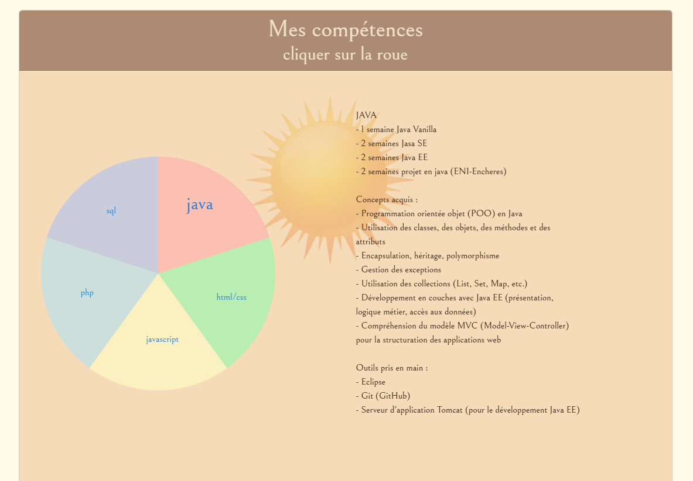
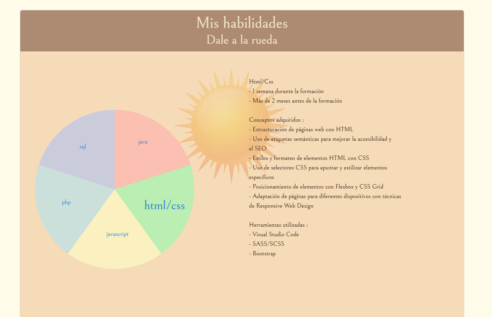

# melchior-jorda.online

## Links
- [Version française](README_FR.md)
- [English version](../README.md)
- [Visita el sitio web](https://melchior-jorda.online/index.html)

## Descripción
¡Bienvenido a **melchior-jorda.online**! Este proyecto sirve como el código fuente de mi sitio web personal, diseñado para ser **responsive** y **dinámico**. El objetivo principal de este sitio es mostrar mi trabajo y habilidades en desarrollo web. Con una interfaz amigable y un diseño atractivo, los visitantes pueden explorar mis proyectos, aprender más sobre mis habilidades y contactarme fácilmente.

## Tecnologías utilizadas
Este proyecto utiliza varias tecnologías para garantizar una experiencia óptima para el usuario:
- **HTML/CSS**: Proporcionan la estructura y el estilo del sitio web, asegurando un diseño claro y agradable.
- **JavaScript**: Agrega interactividad y dinamismo al sitio, permitiendo características avanzadas como animaciones y actualizaciones en tiempo real.
- **PHP**: Maneja las operaciones del lado del servidor, incluyendo el procesamiento de formularios y la gestión de datos.
- **JSON**: Se utiliza como formato de intercambio de datos, facilitando la comunicación entre el cliente y el servidor.

## Uso
Este código está diseñado para presentar mi trabajo de manera profesional. Para visualizar el sitio, simplemente descarga los archivos del proyecto y abre `index.html` en tu navegador. Tendrás acceso a todas las funciones y a la interfaz que he desarrollado.

## Capturas de pantalla
Aquí hay algunas capturas de pantalla que ilustran el diseño y las funcionalidades de mi sitio:

## I/Presentación
¡Bienvenido a **melchior-jorda.online**! Soy Melchior, un apasionado del desarrollo web que siempre está buscando nuevas oportunidades para aprender y crear. Este sitio ha sido diseñado no solo para mostrar mis habilidades técnicas, sino también para ofrecer mis servicios en desarrollo web. Mi enfoque está centrado en el usuario, buscando proporcionar soluciones efectivas y estéticas. Estoy comprometido a trabajar con mis clientes para llevar a cabo sus proyectos de acuerdo con sus necesidades específicas.

## II/Diagrama circular de mis habilidades
Una de las características clave de mi sitio es el diagrama circular interactivo, que destaca mis habilidades técnicas. Cuando un usuario hace clic en el ícono de Java, el gráfico muestra mis niveles de habilidad y experiencias en este área.

Si se hace clic en HTML/CSS, el diagrama se actualiza, reflejando así mis habilidades en estos lenguajes. Esto permite a los visitantes visualizar rápidamente mi experiencia en diseño web.

El mismo gráfico también está disponible en inglés, lo que permite llegar a una audiencia más amplia.

Finalmente, el gráfico también está disponible en español, asegurando que mis habilidades sean accesibles a un público hispanohablante.

Para los usuarios que prefieren una interfaz oscura, también está disponible el modo oscuro, ofreciendo una experiencia visual alternativa.

Además, el gráfico está diseñado para mostrar un encabezado claro, facilitando la navegación y la comprensión de la información presentada.

## III/Mis proyectos realizados
En mi sitio, también encontrarás un carrusel interactivo que presenta mis proyectos recientes. Este carrusel permite a los visitantes desplazarse fácilmente por mis logros y explorar los diferentes aspectos de mi trabajo.

## IV/Formulario de contacto y recepción
Finalmente, he integrado un formulario de contacto en el sitio. Este formulario permite a los visitantes enviarme mensajes formateados, facilitando así la comunicación y la retroalimentación.

Cuando se envía el formulario, recibo un correo electrónico formateado según mis preferencias, lo que me permite gestionar eficazmente las solicitudes de contacto.

## Licencias
Este proyecto está licenciado por Melchior (yo mismo). Para cualquier pregunta o solicitud de uso, no dudes en contactarme a través del formulario de contacto en el sitio web.
