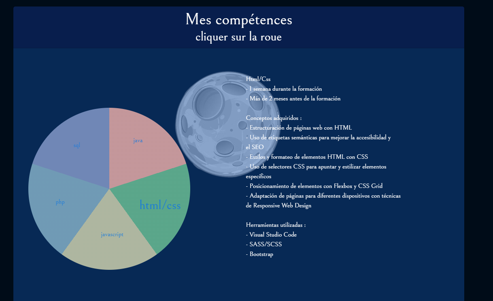

# melchior-jorda.online

## Links
- [English version](../README.md)
- [Versión en Español](README_ES.md)
- [Visitez le site](https://melchior-jorda.online/index.html)

## Description
Bienvenue sur **melchior-jorda.online** ! Ce projet constitue le code source de mon site web personnel, développé pour être **responsive** et **dynamique**. L'objectif principal de ce site est de présenter mes travaux et mes compétences en développement web. Grâce à une interface conviviale et à un design attrayant, les visiteurs peuvent explorer mes projets, en apprendre davantage sur mes compétences et me contacter facilement.

## Technologies utilisées
Ce projet utilise plusieurs technologies pour garantir une expérience utilisateur optimale :
- **HTML/CSS** : Fournissent la structure et le style du site web, assurant une mise en page claire et agréable.
- **JavaScript** : Ajoute de l'interactivité et du dynamisme au site, permettant des fonctionnalités avancées telles que des animations et des mises à jour en temps réel.
- **PHP** : Gère les opérations côté serveur, y compris le traitement des formulaires et la gestion des données.
- **JSON** : Utilisé comme format d'échange de données, facilitant la communication entre le client et le serveur.

## Utilisation
Ce code est conçu pour présenter mon travail de manière professionnelle. Pour visualiser le site, il vous suffit de télécharger les fichiers du projet et d'ouvrir `index.html` dans votre navigateur. Vous aurez ainsi accès à toutes les fonctionnalités et à l'interface que j'ai développées.

## Screenshots
Voici quelques captures d'écran qui illustrent le design et les fonctionnalités de mon site.

## I/Présentation
Bienvenue sur **melchior-jorda.online** ! Je suis Melchior, un passionné de développement web, toujours à la recherche de nouvelles opportunités pour apprendre et créer. Ce site a été conçu non seulement pour présenter mes compétences techniques, mais aussi pour offrir mes services en développement web. Mon approche est centrée sur l'utilisateur, cherchant à fournir des solutions efficaces et esthétiques. Je m'engage à travailler avec mes clients pour réaliser leurs projets selon leurs besoins spécifiques.

## II/Diagramme circulaire de mes compétences
Une des fonctionnalités clés de mon site est le diagramme circulaire interactif, qui met en avant mes compétences techniques. Lorsqu'un utilisateur clique sur l'icône Java, le graphique affiche mes niveaux de compétence et mes expériences dans ce domaine.

Si l'on clique sur HTML/CSS, le diagramme se met à jour, reflétant ainsi mes compétences dans ces langages. Cela permet aux visiteurs de visualiser rapidement mon expertise en matière de conception de sites web.

Le même diagramme est également disponible en anglais, ce qui permet de toucher un public plus large.

Enfin, le graphique est aussi disponible en espagnol, garantissant que mes compétences sont accessibles à un public hispanophone.

Pour les utilisateurs qui préfèrent une interface sombre, le mode sombre est également disponible, offrant une expérience visuelle alternative.

De plus, le graphique est conçu pour afficher un en-tête clair, facilitant la navigation et la compréhension des informations présentées.

## III/Mes projets réalisés
Sur mon site, vous trouverez également un carrousel interactif qui présente mes projets récents. Ce carrousel permet aux visiteurs de faire défiler facilement mes réalisations et d'explorer les différents aspects de mon travail.

## IV/Formulaire de contact & réception
Enfin, j'ai intégré un formulaire de contact sur le site. Ce formulaire permet aux visiteurs de m'envoyer des messages formatés, facilitant ainsi la communication et le retour d'information.

Lorsque le formulaire est soumis, je reçois un e-mail formaté selon mes préférences, me permettant de gérer efficacement les demandes de contact.

## Licences
Ce projet est sous la licence de Melchior (moi-même). Pour toute question ou demande d'utilisation, n'hésitez pas à me contacter via le formulaire de contact sur le site.
